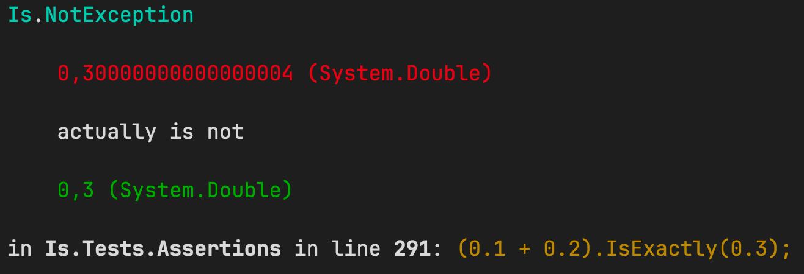

# Minimalistic Assertion Extensions for .NET

**Simple. Readable. Opinionated.**

`Is` is a lightweight assertion library for .NET that focuses on _readable_, _minimal_, and _fail-fast_ test expectations — no assertion clutter, no dependencies, no test framework lock-in.


## ✅ Why use Is?

- 📘 Concise: One word. One assertion.
- 💥 Opinionated: No "IsNot", only assert what you expect, not what you not expect, just fast failure and clarity.
- 🧪 Test-framework agnostic: Works with xUnit, NUnit, MSTest, or none at all.
- ⚙️ Self-contained: No dependencies, no configuration, just drop it in.

## 📦 Get It on NuGet

[](https://www.nuget.org/packages/AssertWithIs/)


The package is published on NuGet under the name [`AssertWithIs`](https://www.nuget.org/packages/AssertWithIs/) because shorter IDs like `Is` or `Is.Assertions` were already taken or reserved.  
Despite the package name, the library itself uses the concise `Is` namespace and generates a single `Is.dll`, so your code stays clean and expressive:


## 🔍 Available Methods

All public methods in `Is` are:

- ❗️ **Extension methods**, designed to be used fluently (`value.Is(...)`)
- 🔤 **Named consistently**: Every method starts with `Is`, making them easy to discover with IntelliSense
- ✂️ **Minimal and deliberate**: Only a small, opinionated set of assertions is exposed

## Method Categories

### Exception Assertions
Methods that assert conditions related to exceptions.

| Method | Description |
|--------|-------------|
| `IsThrowing<T>(Action action)` | Asserts that the given synchronous action throws an exception of type `T`. Returns the exception. |
| `IsThrowing<T>(Func<Task> action)` | Asserts that the given asynchronous function throws an exception of type `T`. Returns the exception. |
| `IsThrowing<T>(Action action, string message)` | Asserts that the given synchronous action throws an exception of type `T` and that the exception message contains the specified substring. |
| `IsThrowing<T>(Func<Task> action, string message)` | Asserts that the given asynchronous function throws an exception of type `T` and that the exception message contains the specified substring. |

### Type Assertions
Methods that assert conditions related to the type of an object.

| Method | Description |
|--------|-------------|
| `Is<T>(object actual)` | Asserts that the actual object is of type `T`. Returns the cast object to the type `T`. |
| `IsNot<T>(object actual)` | Asserts that the actual object is not of type `T`. |

### Equality Assertions
Methods that assert conditions related to equality.

| Method | Description |
|--------|-------------|
| `IsExactly<T>(T actual, T expected)` | Asserts that the actual object is exactly equal to the expected value. |
| `Is(object actual, params object[] expected)` | Asserts that the actual object matches the expected value(s). |
| `IsNot<T>(T actual, T expected)` | Asserts that the actual value is not equal to the expected value. |
| `IsSameAs<T>(T actual, T expected)` | Asserts that the actual object is the same instance as the expected object. |
| `IsDefault<T>(T actual)` | Asserts that the actual value is the default value of its type. |
| `IsSatisfying<T>(T actual, Func<T, bool> predicate)` | Asserts that the actual object satisfies the specified predicate. |

### Collection Assertions
Methods that assert conditions related to collections and sequences.

| Method | Description |
|--------|-------------|
| `IsEmpty<T>(IEnumerable<T> actual)` | Asserts that the sequence is empty. |
| `IsContaining<T>(IEnumerable<T> actual, params T[] expected)` | Asserts that the sequence contains all the specified elements. |
| `IsIn<T>(IEnumerable<T> actual, params T[] expected)` | Asserts that all elements in the actual collection are present in the expected collection. |
| `IsEquivalentTo<T>(IEnumerable<T> actual, IEnumerable<T> expected)` | Asserts that the sequence matches the specified values ignoring item order. |
| `IsUnique<T>(IEnumerable<T> actual, IEnumerable<T> expected)` | Asserts that all elements in the sequence are unique. |

### Comparison Assertions
Methods that assert conditions related to comparisons.

| Method | Description |
|--------|-------------|
| `IsApproximately<T>(T actual, T expected, T epsilon)` | Asserts that the actual floating point is approximately equal to the expected value within a specified epsilon. |
| `IsApproximately<T>(T actual, T expected)` | Asserts that the actual floating point is approximately equal to the expected value with a default epsilon of `1e-6`. |
| `IsGreaterThan<T>(T actual, T other)` | Asserts that the actual value is greater than the given other value. |
| `IsSmallerThan<T>(T actual, T other)` | Asserts that the actual value is smaller than the given other value. |
| `IsBetween<T>(T actual, T min, T max)` | Asserts that the actual value is between the specified min and max exclusive bounds. |
| `IsNotBetween<T>(T actual, T min, T max)` | Asserts that the actual value is not between the specified min and max exclusive bounds. |
| `IsAtLeast<T>(T actual, T other)` | Asserts that the actual value is greater or equal than the given other value. |
| `IsAtMost<T>(T actual, T other)` | Asserts that the actual value is smaller or equal than the given other value. |
| `IsInRange<T>(T actual, T min, T max)` | Asserts that the actual value is between the specified min and max inclusive bounds. |
| `IsPositive<T>(T actual)` | Asserts that the actual value is greater than zero. |
| `IsNegative<T>(T actual)` | Asserts that the actual value is smaller than zero. |

### String Assertions
Methods that assert conditions related to strings.

| Method | Description |
|--------|-------------|
| `IsContaining(string actual, string expected)` | Asserts that the actual string contains the specified substring. |
| `IsStartingWith(string actual, string expected)` | Asserts that the actual string starts with the specified substring. |
| `IsEndingWith(string actual, string expected)` | Asserts that the actual string ends with the specified substring. |
| `IsMatching(string actual, string pattern)` | Asserts that the actual string matches the specified regular expression pattern. Returns the match groups. |
| `IsNotMatching(string actual, string pattern)` | Asserts that the actual string does not match the specified regular expression pattern. |

### Boolean Assertions
Methods that assert conditions related to boolean values.

| Method | Description |
|--------|-------------|
| `IsTrue(bool actual)` | Asserts that a boolean value is `true`. |
| `IsFalse(bool actual)` | Asserts that a boolean value is `false`. |

### Null Assertions
Methods that assert conditions related to null values.

| Method | Description |
|--------|-------------|
| `IsNull(object actual)` | Asserts that an object is `null`. |
| `IsNotNull(object actual)` | Asserts that an object is not `null`. |


> ✅ Because all methods start with `Is`, you can type `.` and just filter by `Is` in IntelliSense. Fast and frictionless.


## 🔧 Usage Examples

### Basic value checks
```csharp
42.Is(42);       // ✅ passes
42.Is(41);       // ❌ throws IsNotException: 42 (System.Int32) is not 41 (System.Int32)
42.Is(42.0);     // ❌ throws IsNotException: 42 (System.Int32) is not 42 (System.Double)

"test".Is("test");               // ✅ passes
```

### Collection checks
```csharp
new[] { 1, 2, 3 }.Is(1, 2, 3);   // ✅ passes (enumerable values check)

new List<int> { 1, 2, 3, 4, 5, 6 }.Where(i => i % 2 == 0).Is(2, 4, 6);     // ✅ passes
new List<int> { 1, 2, 3, 4, 5, 6 }.Where(i => i % 3 == 0).Is(3, 6);        // ✅ passes
new List<int> { 1, 2, 3, 4, 5, 6 }.Where(i => i % 4 == 0).Is(4);           // ✅ passes

new List<int> { 1, 2, 3, 4 }.IsContaining(1, 2);    // ✅ passes
new List<int> { 1, 2 }.IsIn(1, 2, 3, 4);            // ✅ passes
```

### Type checks
```csharp
"hello".Is<string>();     // ✅ passes
"hello".Is<int>();        // ❌ throws IsNotException: "hello" (System.String) is no System.Int32
```

### Numeric comparisons
```csharp
2.999999f.Is(3f)         // ✅ passes
783.0123.Is(783.0124)    // ✅ passes

5.IsSmallerThan(6);      // ✅ passes
6.IsGreaterThan(5.0);    // ✅ passes
5.IsGreaterThan(6);      // ❌ throws IsNotException: 5 (System.Int32) is not greater than 6 (System.Int32)
2.IsBetween(1, 3);       // ✅ passes

0.3.Is(0.1 + 0.2);                // ✅ passes
0.3.IsExactly(0.1 + 0.2);         // ❌ fails
0.3.IsApproximately(0.1 + 0.2);   // ✅ passes

0.333333.Is(1.0 / 3.0);     // ✅ passes
0.33333.Is(1.0 / 3.0);      // ❌ throws IsNotException: 0,33333 (System.Double) is not close to 0,3333333333333333 (System.Double)
```

### Exception assertions
```csharp
static int DivideByZero(int value) => value / 0;
Action action = () => _ = DivideByZero(1);
action.IsThrowing<DivideByZeroException>();  // ✅ passes

Action action = () => 5.IsGreaterThan(6);
action.IsThrowing<IsNotException>("is not greater than");    // ✅ passes
```

### String checks
```csharp
var groups = "hello world".IsMatching("(.*) (.*)");  // ✅ passes
groups[1].Value.Is("hello");  // ✅ passes
groups[2].Value.Is("world");  // ✅ passes

"hello world".IsContaining("hello");    // ✅ passes
```


## ❌ Error messages

Exception messages
- uses colors to highlight important parts
- displays the source of the error (line number and code)




## ⚖️ Design Philosophy

- ❌ No ```.Should()```, no fluent bloat
- ✅ All positive assertions (Is, IsNull, IsTrue, etc.)
- 📢 Failure messages like: ```42 (System.Int32) is not 41 (System.Int32)```
- 🧠 Designed to make tests read like intentions, not machinery


## 🔍 Key Advantages of Is

- 🧠 Ultra-Concise Syntax with Natural Readability
- 🧵 Minimal Dependencies / Fast Startup
    - Lean and dependency-free — ideal for CI pipelines or constrained environments.
- 🧪 Focused on Behavior, Not Chaining
    - Prioritizes clarity over fluent DSL chaining.
- 🔧 Extensible and Easy to Maintain
    - Simple to audit, fork, and adapt for your team or test infrastructure.


## 📝 License

MIT – use freely.

## 🙌 Contributing

Ideas, bug reports, or pull requests are always welcome.

## ❤️ Author

Developed with care by chrismo80
