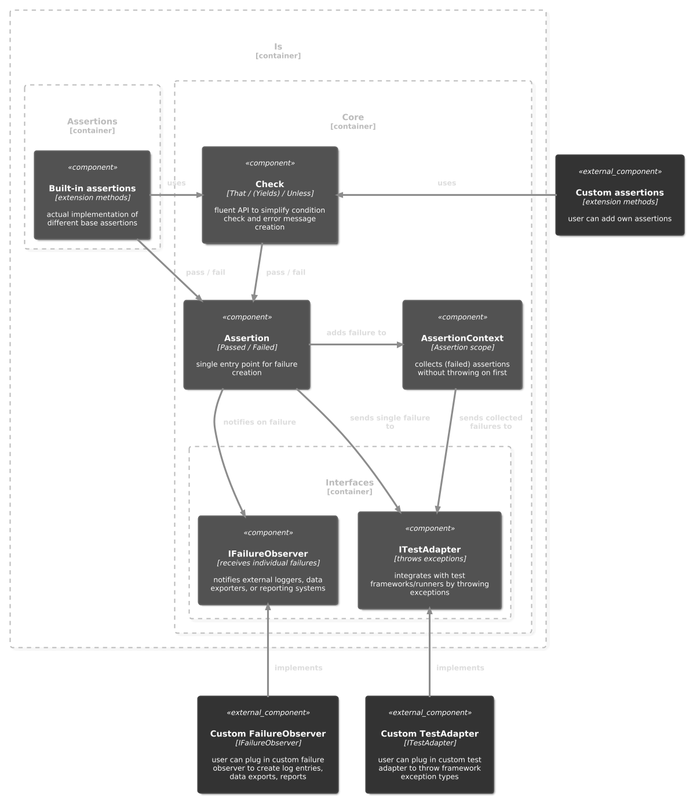

# Minimalistic Assertion Extensions for .NET

**Simple. Readable. Opinionated.**

`Is` is a lightweight assertion library for .NET that focuses on _readable_, _minimal_, and _fail-fast_ test expectations — no assertion clutter, no dependencies, no test framework lock-in.


# Table of content

- [Why use Is?](#why-use-is)
- [Get It on NuGet](#get-it-on-nuget)
- [Architecture](#architecture)
- [Error Messages](#error-messages)
- [Built-in Assertions](#built-in-assertions)
  - [Booleans](#booleans)
  - [Collections](#collections)
  - [Comparisons](#comparisons)
  - [Delegates](#delegates)
  - [Equality](#equality)
  - [Null](#null)
  - [Strings](#strings)
  - [Types](#types)
- [Soft Assertions](#soft-assertions)
  - [`AssertionContext` with using statement](#assertioncontext-with-using-statement)
  - [`AssertionContext` with Test Framework Attribute](#assertioncontext-with-test-framework-attribute)
  - [`ITestAdapter` with Logger](#itestadapter-with-logger)
- [Test Framework Integration](#test-framework-integration)
  - [`ITestAdapter` example for NUnit](#itestadapter-example-for-nunit)
- [Custom Assertions](#custom-assertions)
  - [Example with `IsAssertion(s)` attribute](#example-with-isassertions-attribute)


## Why use Is?

- Concise: One word. One assertion.
- Opinionated: Prioritizes clarity over fluent DSL chaining.
- Test-framework agnostic: Works with xUnit, NUnit, MSTest, or none at all.
- Self-contained: No dependencies, no configuration, just drop it in.
- Versatile: Useful for unit tests, guard clauses or other validation checks within your applications.


All public methods in `Is` are:

- Extension methods: Designed to be used fluently (e.g., `value.Is(...)`).

- Consistently named: Every method starts with `Is`, making them easy to discover with IntelliSense.


## Get It on NuGet

[](https://www.nuget.org/packages/AssertWithIs/)
[](https://www.nuget.org/packages/AssertWithIs/)

The package is published on NuGet under the name [`AssertWithIs`](https://www.nuget.org/packages/AssertWithIs/) because shorter IDs like `Is` or `Is.Assertions` were already taken or reserved.  
Despite the package name, the library itself uses the concise `Is` namespace and generates a single `Is.dll`.


## Architecture

`Is` is built with a clear, modular architecture designed for extensibility and maintainability. Its core components manage assertions, failure reporting, and provide hooks for custom behaviors.




## Error Messages

`Is` provides clear and concise error messages designed to help you quickly identify issues. Failure messages highlight important parts, display the source of the error (line number and code), and typically follow the pattern: `actual (Type) is not expected (Type)`.

Messages
- uses colors to highlight important parts
- displays the source of the error (line number and code)


## Built-in Assertions

Is offers a focused set of built-in assertion categories.

The full public API and its extension methods can be [found here](https://github.com/chrismo80/Is/blob/main/Docs/Is.md)

### Booleans
```csharp
((1.0 / 3.0) == 0.33333).IsTrue(); // ❌
((1.0 / 3.0) == 0.33333).IsFalse(); // ✅
```

### Collections
```csharp
Enumerable.Range(1, 3).IsUnique(); // ✅
Enumerable.Range(1, 3).IsEmpty(); // ❌
Enumerable.Range(1, 3).IsIn(0, 1, 2, 3, 4); // ✅
Enumerable.Range(1, 3).IsEquivalentTo(Enumerable.Range(1, 3).Reverse()); // ✅
```

### Comparisons
```csharp
(1.0 / 3.0).IsApproximately(0.33333); // ❌
(1.0 / 3.0).IsApproximately(0.33333, 0.01); // ✅

5.IsBetween(2, 5); // ❌
5.IsInRange(2, 5); // ✅
5.IsGreaterThan(5); // ❌
5.IsAtLeast(5); // ✅

TimeSpan.Parse("1:23").IsApproximately(TimeSpan.Parse("1:24"), TimeSpan.FromMinutes(1)); // ✅
TimeSpan.Parse("1:23").IsApproximately(TimeSpan.Parse("1:25"), TimeSpan.FromMinutes(1)); // ❌
```

### Delegates
```csharp
static int DivideByZero(int value) => value / 0;
Action action = () => _ = DivideByZero(1);
action.IsThrowing<DivideByZeroException>(); // ✅

Action action = () => 5.IsGreaterThan(6);
action.IsNotThrowing<Is.NotException>(); // ❌

byte[] buffer = [];
Action action = () => buffer = new byte[1024 * 1024 * 10]; // 10 MB
action.IsAllocatingAtMost(10_300); // ✅
action.IsAllocatingAtMost(10_200); // ❌
```

### Equality
```csharp
(0.1 + 0.2).IsExactly(0.3); // ❌
(0.1 + 0.2).Is(0.3); // ✅ (automatically checks Approximately)
2.999999f.Is(3f); // ✅
783.0123.Is(783.0124); // ✅

Enumerable.Range(1, 4).Is(1, 2, 3, 4); // ✅
Enumerable.Range(1, 4).Where(x => x % 2 == 0).Is(2, 4); // ✅
Enumerable.Range(1, 4).Where(x => x % 3 == 0).Is(3); // ✅
```

### Null
```csharp
List<int>? list = null;
list.IsNull(); // ✅
list.IsDefault(); // ✅
list.IsNotNull(); // ❌
```

### Strings
```csharp
var groups = "hello world".IsMatching("(.*) (.*)"); // ✅
groups[1].Value.Is("world"); // ❌
groups[2].Value.Is("world"); // ✅

"hello world".IsContaining("hell"); // ✅
"hello world".IsStartingWith("hell"); // ✅
```

### Types
```csharp
"hello".Is<string>(); // ✅
"hello".Is<int>(); // ❌
```


## Soft Assertions

Sometimes you want to run multiple assertions in a test and evaluate all failures at once, rather than stopping after the first one. The `AssertionContext` provides exactly that capability, enabling "soft assertions" or "assert all" behavior.

The `AssertionContext` acts as a temporary scope. When active, any assertion failures are collected internally instead of immediately reporting. This allows your test code to continue executing and gather all relevant failures.

If any assertion failures remain unhandled (i.e., not manually dequeued using `NextFailure()` or `TakeFailures()`) when the `AssertionContext` is disposed, they are reported in bulk.


### AssertionContext with `using` statement

```csharp
using Is.Core;

using var ctx = AssertionContext.Begin();

"abc".IsContaining("xyz"); // ❌
42.Is(0); // ❌
true.IsTrue(); // ✅

Failure fail1 = ctx.NextFailure(); // Dequeues first failure
Failure fail2 = ctx.NextFailure(); // Dequeues second failure
// At this point, the context is empty. No AggregateException will be thrown on Dispose.

try
{
    using var context = AssertionContext.Begin();

    "foo".Is("bar"); // ❌
    10.IsSmallerThan(5); // ❌
}
catch (AggregateException ex)
{
    ex.InnerExceptions[0].Is<NotException>(); // ✅
    ex.InnerExceptions[1].Is<NotException>(); // ✅
}
```

The `AssertionContext` uses `AsyncLocal` for full async test compatibility, ensuring that only one context is active per async flow at a time.

### AssertionContext with Test Framework Attribute

For test frameworks (e.g. NUnit), you can integrate `AssertionContext` using a custom attribute to automatically manage the context lifetime for test methods or classes.

```csharp
using Is.Core;
using System.Reflection;

[AttributeUsage(AttributeTargets.Class | AttributeTargets.Method)]
public sealed class AssertionContextAttribute : NUnitAttribute, IWrapTestMethod
{
    public TestCommand Wrap(TestCommand command) =>
        new AssertionContextCommand(command);

    private sealed class AssertionContextCommand(TestCommand innerCommand)
        : DelegatingTestCommand(innerCommand)
    {
        public override TestResult Execute(TestExecutionContext testContext)
        {
            var caller = testContext.CurrentTest.Method?.MethodInfo.Name ?? testContext.CurrentTest.Name;

            // Begin the assertion context for the test method
            using var assertionContext = AssertionContext.Begin(caller);

            // Execute the actual test method logic
            return innerCommand.Execute(testContext);
        }
    }
}
```

You can then apply this attribute to your NUnit tests:

```csharp
[Test]
[AssertionContext] // This attribute manages the AssertionContext for the test
public void ContextTest_WithAttribute()
{
    false.IsTrue(); // ❌
    4.Is(5); // ❌

    // Verify expected count and dequeue failures
    AssertionContext.Current?.TakeFailures(2)
        .All(failure => failure.Message.IsContaining("is not")); // ✅
}
```
 holds true for MS Test or xUnit.


### ITestAdapter with Logger

If you don't want to throw exceptions at all, you can use the `ITestAdapter` interface to redirect failures to your logging system. To use this adapter, configure it at the start of your tests at `Configuration.Active.TestAdapter`.

```csharp
public class LoggerTestAdapter : ITestAdapter
{
    public void ReportFailure(Failure failure) =>
        Console.WriteLine(failure.Message);

    public void ReportFailures(string message, List<Failure> failures) =>
        failures.ForEach(ReportFailure);
}
```

You could even implement your own `ITestAdapter`, that simply exports the `Failure`s to json for further analysis tools depending on your use-case.


## Test Framework Integration

`Is` is designed to be framework-agnostic. It achieves this through the `ITestAdapter` interface. This acts as a hook, allowing you to plug in custom logic to handle and throw exceptions that are specific to your chosen test framework (e.g., NUnit.Framework.AssertionException, Xunit.Sdk.XunitException).

By default, `Is` uses a `DefaultTestAdapter` that throws `Is.NotException` directly for single failures and `AggregateException` for multiple failures from `AssertionContext`.

You can hook your custom test adapter via `Configuration.TestAdapter`.
If you do not want exception to be thrown at all, you can inject an `ITestAdapter` implementation that simply logs or exports the failures, depending on your use case.

### ITestAdapter example for NUnit

```csharp
public class NUnitTestAdapter : ITestAdapter
{
    public void ReportSuccess() { }

    public void ReportFailure(Failure failure) =>
        throw new AssertionException(failure.Message);

    public void ReportFailures(string message, List<Failure> failures)
    {
        var messages = string.Join("\n\n", failures.Select(f => f.Message));

        throw new AssertionException($"{message}\n{messages}");
    }
}
```

Of course, you can throw any exception type of your choice such as `AssertFailedException` for MS Test or `XunitException` for xUnit.


## Custom Assertions

`Is` makes it straightforward to create your own custom assertions that integrate seamlessly with the library's features, including `AssertionContext` support and consistent error message formatting.

You'll primarily use the `Check` fluent API within your custom extension methods.

Syntax: `Check.That(condition).Unless(message)`.

To ensure proper source code line detection in error messages, mark your custom assertion methods or their containing class with either `[IsAssertion]` <u>or</u> `[IsAssertions]` attributes from the `Is.Core` namespace.

### Example with `IsAssertion(s)` attribute

```csharp
[IsAssertions] // Mark all methods via class attribute
public static class MyCustomAssertions
{
    [IsAssertion] // Or mark individual methods
    public static bool IsEmail(this string value) => Check
        .That(Regex.Match(value, "^(.*)\@(.*)\.(.*)$").Success)
        .Unless(value, "is no email");

    [IsAssertion]
    public static bool IsDigitsOnly(this string value) => Check
        .That(value.All(char.IsDigit))
        .Unless(value, "contains non-digit characters");
}
```

Your custom assertions integrate seamlessly with the existing fluent style of the library, providing consistent error reporting and soft assertion capabilities.


## License

MIT – use freely.

## Contributing

Ideas, bug reports, or pull requests are always welcome.

## Author

Developed with care by chrismo80
